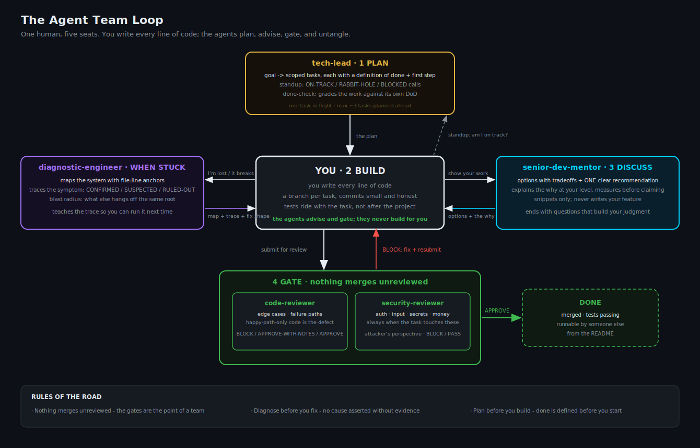

# Core Team

The five always-on seats. These are used every day, at every stage of a product's life - MVP
through enterprise. One human writes the code; these agents plan, advise, gate, and untangle.



## The seats

| Agent | Seat | One line |
|---|---|---|
| [`tech-lead`](tech-lead.md) | The path | Turns a goal into scoped, ordered tasks with a definition of done and a first step; standup and done-check modes keep delivery honest |
| [`senior-dev-mentor`](senior-dev-mentor.md) | The craft | Options with tradeoffs + ONE recommendation + the why, on YOUR code; sharpens the developer, never writes the feature |
| [`diagnostic-engineer`](diagnostic-engineer.md) | The map | When something is broken or illegible: maps the system with file:line anchors, traces the symptom with evidence (CONFIRMED / SUSPECTED / RULED-OUT), finds the blast radius |
| [`code-reviewer`](code-reviewer.md) | The gate | Adversarial pass on edge cases and failure paths; BLOCK / APPROVE verdicts; nothing merges unreviewed |
| [`security-reviewer`](security-reviewer.md) | The other gate | Attacker's perspective on anything touching auth, input, secrets, money, or outbound requests |

## The loop

```
tech-lead scopes  ->  you build  ->  senior-dev-mentor discusses  ->  the gates judge
                            \-> diagnostic-engineer when you are lost in something you did not write
```

## Who do I call?

| Situation | Agent |
|---|---|
| "I want to build X but don't know where to start" | tech-lead (breakdown) |
| "Am I on track? I've been at this a while" | tech-lead (standup) |
| "I think this task is done" | tech-lead (done-check), then the gates |
| "Is this a good way to write this? What are my options?" | senior-dev-mentor |
| "Review this before I merge" | code-reviewer |
| "This touches login / input / secrets / payments" | security-reviewer |
| "Something's broken and I can't see the shape of it" | diagnostic-engineer |

**New here? Read [INSTRUCTIONS.md](INSTRUCTIONS.md)** - a worked end-to-end use case with the
exact prompts to type at every step, plus the anti-patterns.

Full workflow and rules of the road: the [repo README](../README.md).
